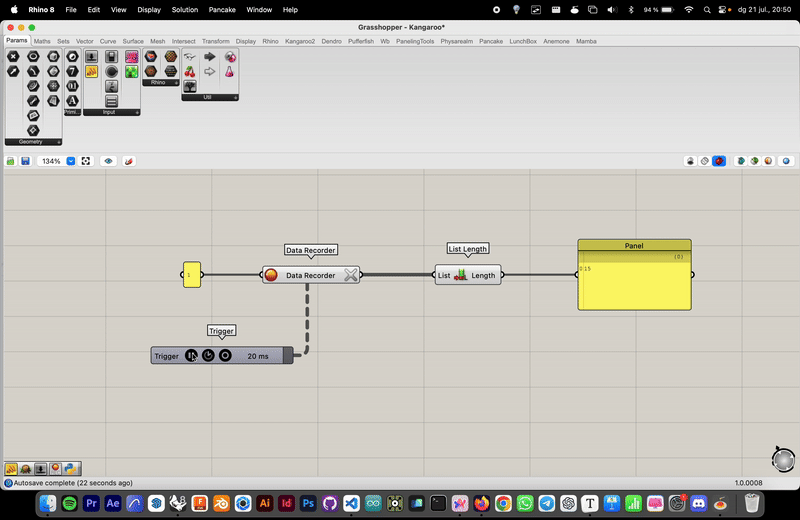

# WIP Grasshopper Animations into Keyshot

----

## Import grasshopper animations to Keyshot as alembic files (.abc)

Still work in progress. Code based on the tutorial [How to export any Mesh or kangaroo animation directly from Grasshopper To Blender using Python](https://youtu.be/Xm__UO0vw8E?si=HCaIqv2emvJkY-vh). 

### Important note

As I mentioned before, this is a work in progress so the code is not pretty efficient. For sure there's better ways to do this without using Blender or having to do all the steps and for sure the code can be way more clean. I'm not a computer science guy, I'm an industrial designer with interest on coding and computational design. I also would appreciate it if you check my [website](https://jmuozan.github.io/jorgemunyozz.github.io/) or support me on my social media. 

### What do you need?

- Grasshopper plug-in for Rhino 3D (If you're checking this documentation probably you already know about it)
- Blender: An open source 3d software. You can download from [here](https://www.blender.org/). (I'm using version 4.0 on MacOS Sonoma)
- Keyshot: Rendering engine, I'm using version 11.3.3 in my tests. There should be no problem with the versions as long as it accepts alembic (.abc) files

### Understanding Grasshopper Animations

To record the different animations we will have to be able to automatically change the different values of a slider. See the following example where a sphere component is connected to a slider that goes from one to 10. 

To change the values we will use the following structure of components. 

Let's look at it step by step. First off I added a Panel with value '0' written on it. This will work as an "activator" for the values. The number written on it won't matter. The panel will get connected to a Data Recorder component. This will keep saving all the different values. Connected to that there's a Trigger component. The trigger will be in charge of changing the value and will be the one "animating". When you right click over it you will get the chance to change the interval value that will determine the time it waits to record another value when the play button on the trigger gets played.

The 'X' button on the trigger will reset the recording and the red button will start/stop it. Let's check the outputs that we get now:

As you can see the output seen in the panel is a new value per each 20 ms determined in the Trigger but the new values are always the same. To solve this we will add a List Length component. List length will take all the values written by the Data Recorder and will keep stacking them. This way an increasing number of values will get written in the output of list length. 

This is the way we will make a "slider" that moves automatically. Going back to the original ball example I added A division component connected to another panel with a '6' written so the count will go slower. Depending on what you want to animate you will have to play with division/multiplication modules. Test until you find your sweet spot.

### How does the code work

#### Grasshopper scripts

These scripts are work of [3D Beast](https://www.youtube.com/@3DBeast) video [How to export any Mesh or kangaroo animation directly from Grasshopper To Blender using Python](https://youtu.be/Xm__UO0vw8E?si=HCaIqv2emvJkY-vh) I really recommend to watch that video before doing it to really understand how do they work and how to set them up. In any case I will overall explain how they work here. 

The main idea of the two grasshopper python scripts is to take the main shape or body, convert it into a mesh and export the Faces and Vertices of the meshes saving them into .csv files that will later be used with Blender's API to rebuild the meshes. 

#### Blender scripts

