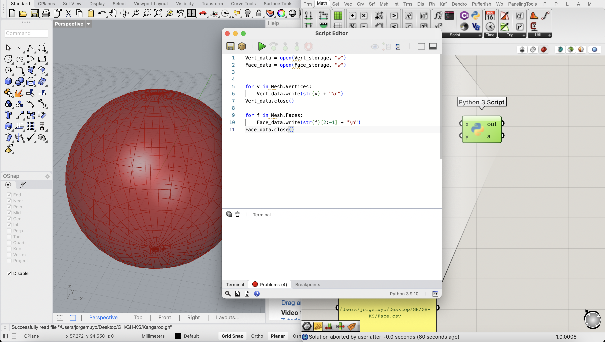

# WIP Grasshopper Animations into Keyshot

----

## Import grasshopper animations to Keyshot as alembic files (.abc)


Still work in progress. Code based on the tutorial [How to export any Mesh or kangaroo animation directly from Grasshopper To Blender using Python](https://youtu.be/Xm__UO0vw8E?si=HCaIqv2emvJkY-vh). 

### Important note

As I mentioned before, this is a work in progress so the code is not pretty efficient. For sure there's better ways to do this without using Blender or having to do all the steps and for sure the code can be way more clean. I'm not a computer science guy, I'm an industrial designer with interest on coding and computational design. I also would appreciate it if you check my [website](https://jmuozan.github.io/jorgemunyozz.github.io/) or support me on my social media. 

### What do you need?

- Grasshopper plug-in for Rhino 3D (If you're checking this documentation probably you already know about it)
- Blender: An open source 3d software. You can download from [here](https://www.blender.org/). (I'm using version 4.0 on MacOS Sonoma)
- Keyshot: Rendering engine, I'm using version 11.3.3 in my tests. There should be no problem with the versions as long as it accepts alembic (.abc) files

### Understanding Grasshopper Animations

To record the different animations we will have to be able to automatically change the different values of a slider. See the following example where a sphere component is connected to a slider that goes from one to 10. 


To change the values we will use the following structure of components. 


Let's look at it step by step. First off I added a Panel with value '0' written on it. This will work as an "activator" for the values. The number written on it won't matter. The panel will get connected to a Data Recorder component. This will keep saving all the different values. Connected to that there's a Trigger component. The trigger will be in charge of changing the value and will be the one "animating". When you right click over it you will get the chance to change the interval value that will determine the time it waits to record another value when the play button on the trigger gets played.


The 'X' button on the trigger will reset the recording and the red button will start/stop it. Let's check the outputs that we get now:


As you can see the output seen in the panel is a new value per each 20 ms determined in the Trigger but the new values are always the same. To solve this we will add a List Length component. List length will take all the values written by the Data Recorder and will keep stacking them. This way an increasing number of values will get written in the output of list length. 


This is the way we will make a "slider" that moves automatically. Going back to the original ball example I added A division component connected to another panel with a '6' written so the count will go slower. Depending on what you want to animate you will have to play with division/multiplication modules. Test until you find your sweet spot.


### How does the code work

#### Grasshopper scripts

These scripts are work of [3D Beast](https://www.youtube.com/@3DBeast) video [How to export any Mesh or kangaroo animation directly from Grasshopper To Blender using Python](https://youtu.be/Xm__UO0vw8E?si=HCaIqv2emvJkY-vh) I really recommend to watch that video before doing it to really understand how do they work and how to set them up. In any case I will overall explain how they work here. 


The main idea of the first Grasshopper Python script ``` GHPython_1.py``` is to take the main shape or body, convert it into a mesh and export the Faces and Vertices of the meshes saving them into .csv files that will later be used with Blender's API to rebuild the meshes. 

```python
Vert_data = open(Vert_storage, "w")
Face_data = open(Face_storage, "w")


for v in Mesh.Vertices:
	Vert_data.write(str(v) + "\n")
Vert_data.close()

for f in Mesh.Faces:
	Face_data.write(str(f)[2:-1] + "\n")
Face_data.close()
```

Here's a step-by-step explanation:

1. **Open files for writing:**

```python
Vert_data = open(Vert_storage, "w")
Face_data = open(Face_storage, "w")
```

- ```Vert_storage``` and ```Face_storage``` are file paths that will be set inside Grasshopper.

- ```open(Vert_storage, "w")``` opens (or creates if you don't have it) the file specified by Vert_storage in write mode and assigns the file object to Vert_data.

- ```open(Face_storage, "w")``` does the same for Face_storage and assigns the file object to Face_data.
  
  
  
2. **Write vertices to the file:**

```python
for v in Mesh.Vertices:
    Vert_data.write(str(v) + "\n")
Vert_data.close()
```

- ```Mesh.Vertices``` is a list of vertex objects.
- ```for v in Mesh.Vertices:``` will go through each vertex in the list.
- ```Vert_data.write(str(v) + "\n")``` will convert the vertex v to a string and will write it to the Vert_data file, followed by a newline \n.
- ```Vert_data.close()``` will close the Vert_data file, ensuring all the data is written.

3. **Write faces to the file:**

```python
for f in Mesh.Faces:
    Face_data.write(str(f)[2:-1] + "\n")
Face_data.close()
```

- ```Mesh.Faces``` is a list of face objects.
- ```for f in Mesh.Faces:``` will go through each face in the list.
- ```Face_data.write(str(f)[2:-1] + "\n")``` will convert the face object f to a string, slicing the string to remove the first two and the last character ([2:-1]), and will write it to the Face_data file, followed by a newline \n.
- ```Face_data.close()``` will close the Face_data file, ensuring all the data is written.

To set it up inside grasshopper let's use the sphere example from before:

First of all we will have to transform the data from the sphere to a mesh as the script takes the vertex and faces information. This will be possible to achieve by connecting a ```Mesh``` component. 


In order to remove duplicate edges in the mesh we will add a ```Combine&Clean``` component to the ```Mesh``` so the previous script will only save the necessary data.


After that we will add a ```Python 3 script``` component and two panels. 


Inside the panels we will write the paths where we want to create the .csv files and inside the python component we will copy the first script and click save. Remember that the path structure will change depending on the OS you're using.




Now check that if you zoom on top of the Python component you will see different ```+``` and ```-``` signs. We will click on any of the plus signs in the lefts side of the component and will create a new input. 


After having the 3 inputs we will rename them by clicking on top of each text and writing the new name in the top part. The three final inputs should be named ```Mesh``` ```Vert_storage``` and ```Face_storage```.


After this we will connect the ```Combine&Clean``` component to ```Mesh``` and the panels with the paths to ```Vert_storage``` and ```Face_storage```. Also you'll have to right click on top of mesh input on the python component and change the type to ```Mesh```.


Now, going into the second Grasshopper Python script ``` GHPython_2.py```. The main idea here is to save the animation data of the mesh vertices inside a .csv file too. Here's a step by step code explanation:

```python
if Clear:
	open(Animation_path, "w")
if not Clear:
	A_data = open(Animation_path, "a")
	for v in Mesh.Vertices:
		A_data.write(str(v) + ",")
	A_data.write("\n")
A_data.close()
```

1. **Conditional file opening:**

```python
if Clear:
    open(Animation_path, "w")
```

- If the variable `Clear` is `True`, the file at `Animation_path` is opened in write mode (`"w"`), which clears the file's contents. 

2. **Appending data to the file:**

```python
if not Clear:
    A_data = open(Animation_path, "a")
    for v in Mesh.Vertices:
        A_data.write(str(v) + ",")
    A_data.write("\n")
```

- If `Clear` is `False`, the file at `Animation_path` is opened in append mode (`"a"`) and assigned to the variable `A_data`.
- `for v in Mesh.Vertices:` iterates over each vertex in the list `Mesh.Vertices`.
- `A_data.write(str(v) + ",")` converts the vertex object `v` to a string and writes it to the file `A_data`, followed by a comma.
- After all vertices have been written, `A_data.write("\n")` writes a newline character to the file, ending the current line of data.

3. **Closing the file:**

```python
A_data.close()
```

- This ensures that the file `A_data` is properly closed after writing.

To set it up inside grasshopper a similar process to the previous script will be followed. Let's look again at the sphere example:

A new ```Python 3 Script``` component will be added to the canvas and the code will be copied and saved inside. After this a new input will be added and all of them will be renamed to `Mesh`, `Clear` and `Animation_path`. 


 `Mesh` will be connected to the `Combine&Clean` module again,  `Clear` will be connected to a `Button` component and lastly, `Animation_path` will be connected to a new panel with the path of the new .csv file created to save the animation data. This should be the final python set up:


To record or animation data we will only have to press the button to start recording. Once the button gets pressed by pressing the play button on the trigger component the sphere will start to get bigger and data will be saved in the .csv file until the play button gets pressed again. With that done, all the work inside Grasshopper will be done.


#### Blender script


```python
import bpy
import csv
import os

# Path to the OBJ_SEQUENCE folder
output_dir = "/Users/jorgemuyo/Desktop/GH/GH-KS/OBJ_SEQUENCE"

# Create the directory if it doesn't exist
if not os.path.exists(output_dir):
    os.makedirs(output_dir)

# Delete all objects in the scene
bpy.ops.object.select_all(action='SELECT')
bpy.ops.object.delete()

# Read files
with open("/Users/jorgemuyo/Desktop/GH/GH-KS/Face.csv") as f:
    Face_data = list((csv.reader(f)))

with open("/Users/jorgemuyo/Desktop/GH/GH-KS/Vert.csv") as v:
    Vert_data = list((csv.reader(v)))

# Getting vert and face
Vert = ([tuple(map(float, x)) for x in Vert_data])
Face = ([tuple(map(int, x)) for x in Face_data])
Edge = []

# Generating meshes
mesh = bpy.data.meshes.new("from_gh")
obj = bpy.data.objects.new(mesh.name, mesh)
col = bpy.data.collections.get("Collection")
if col is None:
    col = bpy.context.scene.collection
col.objects.link(obj)
bpy.context.view_layer.objects.active = obj
mesh.from_pydata(Vert, Edge, Face)

# Read files for animation_data and arrange
with open("/Users/jorgemuyo/Desktop/GH/GH-KS/Animation.csv") as a:
    Animation_data = list(csv.reader(a, quoting=csv.QUOTE_NONNUMERIC))

itr = len(Animation_data)
no_co = len(Animation_data[0]) - 1
no_v = int(no_co / 3)
v_co = [[tuple(x[i:i+3]) for i in range(0, no_co, 3)] for x in Animation_data]

# Getting last created objects
context = bpy.context
ob = context.object
me = ob.data

print("Start keyframing")
# Keyframing
for i in range(itr):
    for j in range(no_v):
        v = me.vertices[j]
        v.co = v_co[i][j]
        v.keyframe_insert("co")

    bpy.context.scene.frame_current += 3
    perc = "{:.0%}".format(i / itr)
    print(perc, end="\r")
print("Successfully imported")

# Add subdivision modifier with 2 levels
mod_subsurf = obj.modifiers.new(name="Subdivision", type='SUBSURF')
mod_subsurf.levels = 3
mod_subsurf.render_levels = 3

# Deselect all objects
bpy.ops.object.select_all(action='DESELECT')

# Select all objects
bpy.ops.object.select_all(action='SELECT')

# Export each frame as an OBJ file
for frame in range(1, bpy.context.scene.frame_end + 1):
    bpy.context.scene.frame_set(frame)
    filepath = os.path.join(output_dir, f"frame_{frame:04d}.obj")
    bpy.ops.wm.obj_export(filepath=filepath, export_selected_objects=True, export_materials=False)

print("Exported all frames as OBJ files")

```

```python
import bpy
import os
import re

# Delete all objects in the scene
bpy.ops.object.select_all(action='SELECT')
bpy.ops.object.delete()

# Path to the folder containing the obj files
folder_path = "/Users/jorgemuyo/Desktop/GH/GH-KS/OBJ_SEQUENCE"

# Function to sort files by numerical suffix
def numerical_sort(value):
    numbers = re.findall(r'\d+', value)
    return int(numbers[-1]) if numbers else -1

# List all files in the directory, filter .obj files, and sort them
file_list = sorted([f for f in os.listdir(folder_path) if f.endswith('.obj')], key=numerical_sort)

# Function to import obj file
def import_obj_file(file_path):
    bpy.ops.wm.obj_import(filepath=file_path)
    obj = bpy.context.selected_objects[0]
    return obj

# Import the first OBJ file and use it as the base mesh
base_obj = import_obj_file(os.path.join(folder_path, file_list[0]))
base_obj.name = "BaseMesh"
bpy.context.view_layer.objects.active = base_obj
base_obj.shape_key_add(name="Basis", from_mix=False)

# Function to create shape keys from subsequent OBJ files
def create_shape_keys(base_obj, file_list):
    for i, file_name in enumerate(file_list[1:]):
        file_path = os.path.join(folder_path, file_name)
        temp_obj = import_obj_file(file_path)
        
        shape_key = base_obj.shape_key_add(name=f"Frame_{i+1}", from_mix=False)
        
        # Copy vertex positions from the imported object to the shape key
        for j, vert in enumerate(temp_obj.data.vertices):
            shape_key.data[j].co = vert.co
        
        # Delete the temporary object
        bpy.data.objects.remove(temp_obj, do_unlink=True)
        
        print(f"Created shape key for {file_name}")

# Create shape keys
create_shape_keys(base_obj, file_list)

# Function to animate shape key influence
def animate_shape_keys(base_obj, file_list):
    for frame, file_name in enumerate(file_list[1:], start=1):
        bpy.context.scene.frame_set(frame)
        for sk in base_obj.data.shape_keys.key_blocks:
            sk.value = 0.0
            sk.keyframe_insert(data_path="value", frame=frame)
        shape_key = base_obj.data.shape_keys.key_blocks[f"Frame_{frame}"]
        shape_key.value = 1.0
        shape_key.keyframe_insert(data_path="value", frame=frame)
        print(f"Frame {frame}: Shape key {shape_key.name} set to 1.0")

# Animate shape keys
animate_shape_keys(base_obj, file_list)

# Clean up the scene by deleting all objects except the base_obj
def cleanup_scene(base_obj):
    for obj in bpy.context.scene.objects:
        if obj != base_obj and obj.type != 'CAMERA' and obj.type != 'LIGHT':
            bpy.data.objects.remove(obj, do_unlink=True)

# Perform cleanup
cleanup_scene(base_obj)

print("Mesh deforming animation creation complete.")

# Deselect all objects
bpy.ops.object.select_all(action='DESELECT')

# Select all objects
bpy.ops.object.select_all(action='SELECT')

# Export the selection as an Alembic file (.abc)
abc_export_path = os.path.join(folder_path, "exported_animation.abc")
bpy.ops.wm.alembic_export(filepath=abc_export_path, selected=True)

print(f"Alembic file exported to {abc_export_path}")
```

```python
# Export the selected objects as Alembic
bpy.ops.wm.alembic_export(
    filepath=output_path,
    check_existing=False,
    selected=True,  # Export only selected objects
    start=bpy.context.scene.frame_start,  # Start frame
    end=bpy.context.scene.frame_end,  # End frame
    xsamples=1,
    as_background_job=False,
    uv_write=True,
    pack_uv=False,
    geom_custom_property=False,
    time_sampling='1',  # Per frame sampling
    global_scale=1.0,
    subframe=1.0,
    apply_subdiv=True,
    flatten=False,
    visible_objects_only=True,
    renderable_only=True,
    face_sets=True,
    uvs=True,
    vertex_colors=False,
    extra_attributes='',
    export_hair=False,
    export_particles=False,
    triangulate=False,
    quad_method='SHORTEST_DIAGONAL',
    ngon_method='BEAUTY'
)
```

